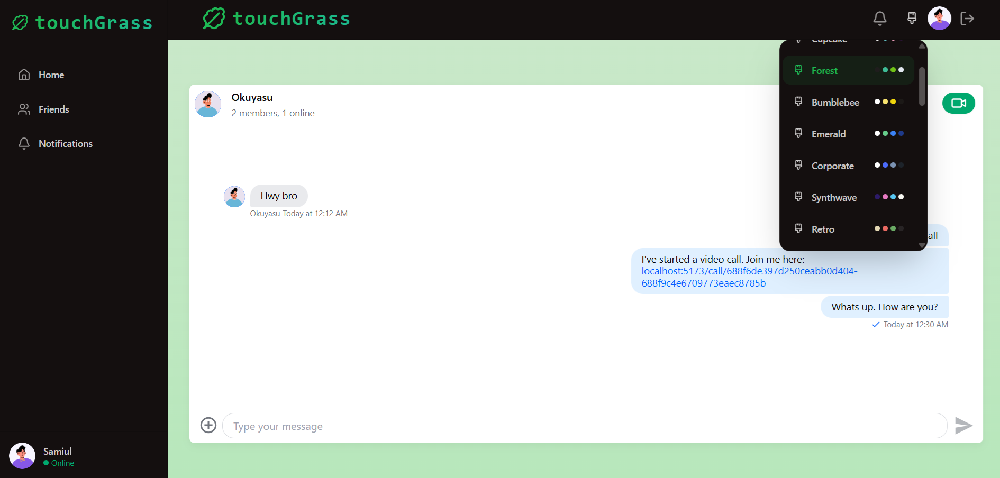
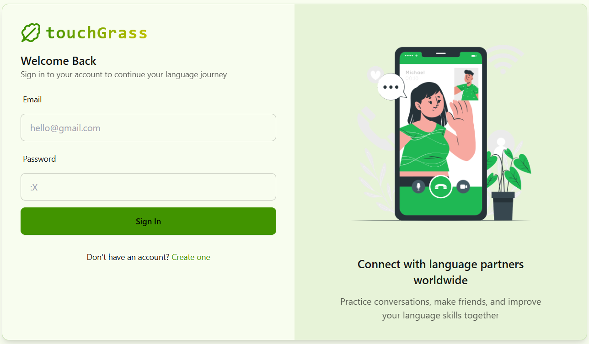

# TouchGrass 🌱

A fun, modern social platform for chat and video calls, built with EMRN stack (Express, MongoDB, React, Node.js).

[Live Demo 🚀](https://touchgrass-d3wb.onrender.com/chat/688f6de397d250ceabb0d404)

---

## Features
- Real-time chat & video calls
- Language exchange & friend system
- Onboarding, notifications, and more
- Clean, responsive UI

## Preview




---

## Getting Started

1. **Clone the repo:**
   ```bash
   git clone https://github.com/safwansatil/touchGrass.git
   ```
2. **Install dependencies:**
   ```bash
   cd touchGrass/backend && npm install
   cd ../frontend && npm install
   ```
3. **Set up environment variables** in both `backend/.env` and `frontend/.env` 
4. **Run the app:**
   - Backend: `npm start` in `/backend`
   - Frontend: `npm run dev` in `/frontend`

---

## Feedback & Learning

I'm always open to feedback, learning, and collaboration! Feel free to reach out:
- Email: asf1k.til@gmail.com
- GitHub: [safwansatil](https://github.com/safwansatil)

---


---

> Made with ☕, curiosity, and a love for building cool things. Touch grass, make friends, and have fun!
